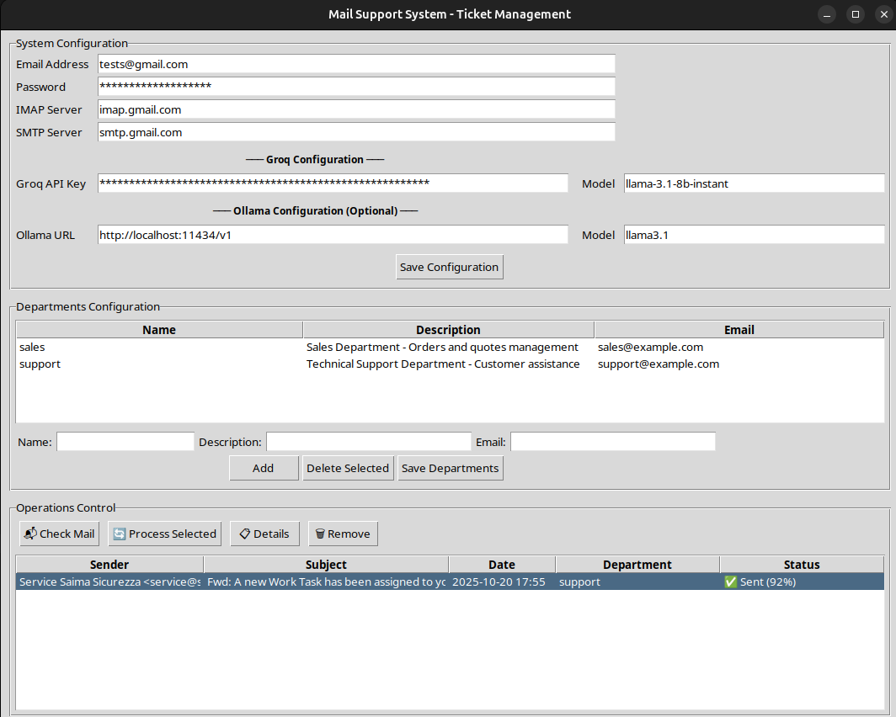
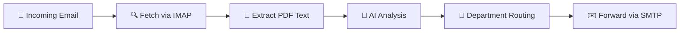

# 🎫 Automated Mail Support System

> **AI-Powered Ticket Management System** with intelligent department routing and automated email processing

[](https://www.python.org/downloads/)
[](LICENSE)
[](https://groq.com)
[](https://ollama.com)

Transform your email support workflow with AI-powered automation. This system automatically fetches, analyzes, and routes support tickets to the right departments using state-of-the-art language models.

---

## ✨ Key Features

🤖 **Smart AI Analysis** - Leverages Groq or Ollama models for intelligent ticket understanding  
📎 **PDF Extraction** - Automatically extracts text from PDF attachments  
🎯 **Intelligent Routing** - Routes tickets to the correct department based on content  
🖥️ **Beautiful GUI** - User-friendly Tkinter interface with real-time preview  
🔧 **Modular Design** - Easily extendable architecture  
⚙️ **Flexible Models** - Choose between cloud (Groq) or local (Ollama) AI models  
📧 **Multi-Provider** - Works with Gmail, Outlook, and other email providers

## 📸 Interface Preview



*Clean and intuitive interface for managing support tickets*

---

## � Quick Start

Get up and running in 5 minutes!

### 1️⃣ Setup Environment

```bash
# Clone or download the repository
cd "Automated Mail Support System"

# Create virtual environment
python3 -m venv .venv
source .venv/bin/activate  # On Windows: .venv\Scripts\activate

# Install dependencies
pip install python-dotenv pdfplumber requests
```

### 2️⃣ Configure Email Account

> ⚠️ **IMPORTANT**: Gmail requires an **App Password**, not your regular password!

📖 **Complete Setup Guide**: [GMAIL_SETUP.md](GMAIL_SETUP.md)

**Quick Gmail Configuration**:
- **IMAP**: `imap.gmail.com`
- **SMTP**: `smtp.gmail.com`
- **Password**: Generate an App Password from [Google Account Settings](https://myaccount.google.com/apppasswords)

### 3️⃣ Choose Your AI Provider

#### 🌐 Option A: Groq (Recommended - Cloud-based, Free Tier)

```bash
# 1. Get your API key from: https://console.groq.com
# 2. Enter it in the GUI along with your chosen model
```

**Available Models**:
- `llama-3.1-8b-instant` ⚡ (default - fastest)
- `llama-3.1-70b-versatile` 🎯 (most accurate)
- `mixtral-8x7b-32768` 📚 (long context)
- `gemma2-9b-it` 💡 (efficient)

#### 💻 Option B: Ollama (Local - Complete Privacy)

```bash
# 1. Install Ollama from: https://ollama.com
# 2. Pull a model
ollama pull llama3.1

# 3. Configure in GUI:
#    - URL: http://localhost:11434/v1
#    - Model: llama3.1
```

**Popular Models**: `llama3.1`, `llama3.2`, `mistral`, `phi3`, `qwen2.5`

### 4️⃣ Launch the Application

```bash
python gui/app_gui_v2.py
```

🎉 **That's it!** The GUI will open and you're ready to start processing tickets.

---

## � How It Works



1. **📧 Configure** - Set up email credentials and AI provider
2. **🏢 Add Departments** - Define departments with names, descriptions, and emails
3. **🔍 Check Mail** - Fetch unread emails from inbox
4. **🤖 AI Analysis** - Let AI analyze content and suggest the best department
5. **✅ Confirm & Send** - Review and forward to the appropriate department

---

## 📧 Email Provider Setup

### Gmail Users (Most Common)

> ⚠️ **Critical**: Gmail requires an **App Password**, not your regular password!

**Quick Steps**:
1. Enable [2-Step Verification](https://myaccount.google.com/security)
2. Generate [App Password](https://myaccount.google.com/apppasswords)
3. Use the 16-character App Password in the application

📖 **Detailed Guide**: See [GMAIL_SETUP.md](GMAIL_SETUP.md) for screenshots and troubleshooting

### Other Providers

- **Outlook/Hotmail**: IMAP: `outlook.office365.com`, SMTP: `smtp.office365.com`
- **Yahoo**: May require App Password like Gmail
- **Custom SMTP/IMAP**: Enter your provider's settings

---

## 🤖 AI Models Comparison

| Provider | Model | Speed | Accuracy | Context | Best For |
|----------|-------|-------|----------|---------|----------|
| **Groq** | llama-3.1-8b-instant | ⚡⚡⚡ | ⭐⭐⭐ | 8K | Quick routing |
| **Groq** | llama-3.1-70b-versatile | ⚡⚡ | ⭐⭐⭐⭐⭐ | 32K | Complex analysis |
| **Groq** | mixtral-8x7b-32768 | ⚡⚡ | ⭐⭐⭐⭐ | 32K | Long documents |
| **Ollama** | llama3.1 (local) | ⚡ | ⭐⭐⭐⭐ | 128K | Privacy-first |

💡 **Recommendation**: Start with `llama-3.1-8b-instant` for best speed/accuracy balance.

---

## 📁 Project Structure

```
📦 Automated Mail Support System
├── 🖥️ gui/
│   ├── app_gui_v2.py              # Main GUI application
│   ├── config_manager.py          # Configuration handler
│   └── reparti_config.json        # Department definitions
├── 🔧 modules/
│   ├── ticket_processor_simple.py # AI ticket analysis
│   ├── mail_fetcher.py            # IMAP email retrieval
│   ├── mail_sender.py             # SMTP email sending
│   ├── process_mail.py            # Email & PDF parsing
│   ├── redirect_engine.py         # Geographic routing
│   └── azure_maps_full.py         # Geolocation services
├── 📚 tests/                      # Testing utilities
├── 📖 README.md                   # This file
├── 📖 GMAIL_SETUP.md              # Gmail configuration guide
├── ⚙️ requirements.txt            # Python dependencies
└── 🔒 .env.example                # Configuration template
```

## 🔧 Core Modules

| Module | Purpose |
|--------|---------|
| `ticket_processor_simple` | AI-powered ticket analysis without Langchain dependency |
| `mail_fetcher` | IMAP email retrieval with attachment handling |
| `mail_sender` | SMTP email forwarding with PDF attachments |
| `process_mail` | Email body and PDF text extraction |
| `redirect_engine` | Geographic-based routing (for automated loop) |
| `azure_maps_full` | Location geocoding using Azure Maps API |

---

## 🛠️ Advanced Usage

### Automated Mode (Geographic Routing)

For advanced users who need geographic-based routing to 3 areas (North/Center/South):

```bash
# Install additional dependencies
pip install -r requirements.txt

# Configure Azure Maps API key in .env
# Run automated loop
python main_loop_v2.py
```

This mode requires:
- Langchain packages
- Azure Maps API key
- Geographic database setup

---

## 🤝 Contributing

This is a private project. If you have suggestions or find issues, please contact the repository owner.

---

## 📝 License

**Private Project** - All rights reserved

---

## 🙏 Acknowledgments

- **Groq** - For lightning-fast AI inference
- **Ollama** - For local AI model support
- **Python Community** - For excellent libraries

---

<div align="center">

**Made with ❤️ for efficient support ticket management**

⭐ Star this repo if you find it useful!

</div>
```
