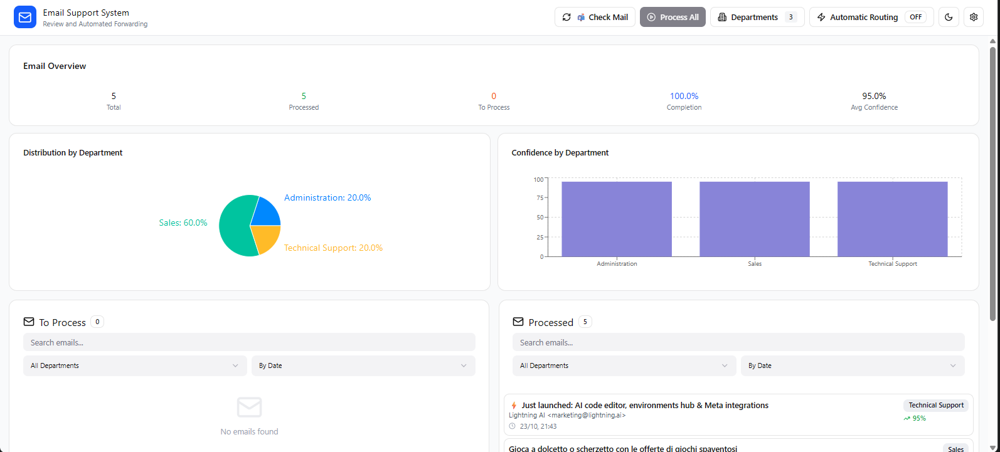

# 📧 Automated Mail Support System (SAAM)

> **AI-Powered Email Classification & Routing System** with React UI and Python Backend

[](https://reactjs.org/)
[](https://www.typescriptlang.org/)
[](https://flask.palletsprojects.com/)
[](https://www.python.org/)

**SAAM** (Sistema Automatico per la gestione della posta di Assistenza e Manutenzione) è un sistema intelligente che analizza automaticamente le email in arrivo, le classifica utilizzando AI locale (Ollama), e le inoltra al dipartimento competente.

---

## ✨ Funzionalità Principali

🤖 **AI Locale con Ollama** - Classificazione intelligente senza servizi cloud  
📊 **Dashboard con Statistiche** - Visualizzazione real-time e storico completo  
📧 **Integrazione Email IMAP/SMTP** - Funziona con Gmail, Outlook e altri provider  
⚡ **Modalità Automatica** - Controllo e processamento periodico senza intervento  
🔄 **Modalità Manuale** - Revisione e override delle decisioni AI  
💾 **Persistenza Dati** - Storico email e statistiche salvate automaticamente  
🌐 **Multilingua** - Supporto Italiano/Inglese  
🎨 **UI Moderna** - Interfaccia responsive con tema scuro/chiaro  
🎨 **Personalizzazione Dipartimenti** - Icon picker e color picker per customizzare ogni dipartimento  
📋 **Gestione Dipartimenti Avanzata** - Visualizzazione rapida con tabella compatta e editing inline  

---

## 📸 Screenshot



*Dashboard principale con statistiche giornaliere, storico all-time, email da processare e già processate*

---

## 🏗️ Architettura

```
┌──────────────────────────────────────────┐
│  Frontend React (Port 3000)              │
│  ┌────────────────────────────────────┐  │
│  │ • Dashboard con grafici            │  │
│  │ • Lista email To Process/Processed │  │
│  │ • Configurazione dipartimenti      │  │
│  │ • Impostazioni AI e automazione    │  │
│  └────────────────────────────────────┘  │
│            ↓ Vite Proxy + REST API       │
└──────────────────────────────────────────┘
                    ↓
┌──────────────────────────────────────────┐
│  Backend Flask (Port 5000)               │
│  ┌────────────────────────────────────┐  │
│  │ • Email Fetcher (IMAP)             │  │
│  │ • Email Sender (SMTP)              │  │
│  │ • AI Processor (Ollama)            │  │
│  │ • Stats Manager (JSON persistence) │  │
│  │ • Email Storage (JSON persistence) │  │
│  └────────────────────────────────────┘  │
└──────────────────────────────────────────┘
                    ↓
┌──────────────────────────────────────────┐
│  Ollama (Port 11434)                     │
│  • Gemma3:4b (default) o altri modelli   │
│  • Analisi locale senza cloud            │
└──────────────────────────────────────────┘
```

---

## 🚀 Installazione Rapida

### Prerequisiti

- **Python 3.12+** installato
- **Node.js 18+** e npm installati
- **Git** installato
- **Account email** (Gmail consigliato con App Password)
- **Ollama** installato (https://ollama.com)

### 1️⃣ Clona il Repository

```powershell
git clone https://github.com/Gaia-Cecchi/Automated-Mail-Support-System-with-UI.git
cd "Automated Mail Support System\code"
```

### 2️⃣ Setup Backend Python

```powershell
# Crea virtual environment
python -m venv venv

# Attiva virtual environment
.\venv\Scripts\Activate.ps1

# Installa dipendenze
pip install -r requirements.txt
```

### 3️⃣ Setup Frontend React

```powershell
cd figmamake
npm install
cd ..
```

### 4️⃣ Installa e Configura Ollama

```powershell
# Scarica Ollama da https://ollama.com e installalo

# Verifica installazione
ollama list

# Scarica modello consigliato (circa 2.5GB)
ollama pull gemma3:4b

# Avvia Ollama (se non già avviato)
ollama serve
```

### 5️⃣ Avvia il Sistema

**Terminal 1 - Backend:**
```powershell
cd "path\to\Automated Mail Support System\code"
.\venv\Scripts\Activate.ps1
python backend\api.py
```
✅ Backend attivo su **http://localhost:5000**

**Terminal 2 - Frontend:**
```powershell
cd "path\to\Automated Mail Support System\code\figmamake"
npm run dev
```
✅ Frontend attivo su **http://localhost:3000**

**Terminal 3 - Ollama:**
```powershell
ollama serve
```
✅ Ollama attivo su **http://localhost:11434**

---

## ⚙️ Configurazione Iniziale

### 1. Accedi all'Interfaccia

Apri il browser su **http://localhost:3000**

### 2. Configura Email (Tab Settings → Email)

**Per Gmail:**
1. Abilita 2-Step Verification: https://myaccount.google.com/security
2. Genera App Password: https://myaccount.google.com/apppasswords
3. Inserisci nella configurazione:
   ```
   Email: tua-email@gmail.com
   Password: xxxx xxxx xxxx xxxx  (16 caratteri App Password)
   IMAP Server: imap.gmail.com
   SMTP Server: smtp.gmail.com
   ```

**Per altri provider:**
- Outlook: `outlook.office365.com` (IMAP e SMTP)
- Yahoo: `imap.mail.yahoo.com` e `smtp.mail.yahoo.com`

### 3. Configura AI Provider (Tab Settings → AI Provider)

```
Provider: Ollama
URL: http://localhost:11434/v1
Model: gemma3:4b
```

### 4. Configura Dipartimenti (Tab Settings → Departments)

Aggiungi i dipartimenti della tua organizzazione con icone e colori personalizzati:

- **Nome**: Technical Support
- **Icona**: Wrench (scegli tra 200+ icone disponibili)
- **Colore**: #3B82F6 (blu) - scegli dalla palette o inserisci un codice esadecimale
- **Email**: supporto@azienda.it

Le icone e i colori scelti appariranno ovunque: nei tag delle email, nei grafici della dashboard, e nella lista dipartimenti.

**Gestione Rapida Dipartimenti**: Clicca sul pulsante "Departments" nell'header per visualizzare tutti i dipartimenti in una tabella compatta con editing inline.

### 5. Salva Configurazione

Clicca **💾 Save Settings** - la configurazione verrà salvata in `config_api.json`

---

## 📖 Come Usare SAAM

### Modalità Manuale (Default)

1. **Controlla Email**: Clicca **📬 Check Mail** per scaricare nuove email
2. **Visualizza Email**: Le email appaiono nella colonna "To Process"
3. **Analizza Email**: Clicca su un'email → **🔄 Process** → l'AI la analizza
4. **Revisiona Suggerimento**: Controlla dipartimento suggerito e confidence score
5. **Conferma o Modifica**: Conferma il dipartimento o scegliene un altro
6. **Inoltra**: Clicca **✉️ Forward** → l'email viene inoltrata

### Modalità Automatica

1. **Attiva Automazione**: Toggle **⚡ Automatic Routing** nell'header
2. **Configura Intervallo**: Settings → Automation → Check Every (minuti)
3. **Il sistema**:
   - Controlla nuove email ogni N minuti
   - Le analizza automaticamente con AI
   - Le inoltra al dipartimento suggerito (se confidence > soglia)
   - Mostra notifiche per ogni operazione

### Dashboard e Statistiche

**� Received Today**: Statistiche delle email ricevute oggi
- Total: Totale email ricevute
- Forwarded: Email inoltrate
- Confidence: Confidence media AI
- To Process: Email ancora da processare

**📊 All Time**: Statistiche storiche persistenti
- Dati salvati in `email_stats.json`
- Non si azzerano al riavvio

**Grafici**:
- **Distribution by Department**: Distribuzione email per dipartimento
- **Confidence by Department**: Accuracy AI per dipartimento

---

## 📁 Struttura File e Persistenza

```
code/
├── backend/
│   ├── api.py                      # Server Flask
│   ├── modules/
│   │   ├── mail_fetcher.py         # Download email IMAP
│   │   ├── mail_sender.py          # Invio email SMTP
│   │   ├── ticket_processor_simple.py  # Analisi AI
│   │   ├── stats_manager.py        # Gestione statistiche
│   │   └── email_storage.py        # Persistenza email
│
├── figmamake/                      # Frontend React
│   ├── src/
│   │   ├── components/             # Componenti UI
│   │   ├── services/api.ts         # Client API
│   │   └── App.tsx                 # App principale
│   └── vite.config.ts              # Config Vite con proxy
│
├── config_api.json                 # ⚠️ Configurazione (non committare!)
├── reparti_api.json                # Dipartimenti
├── email_stats.json                # Statistiche storiche
├── emails.json                     # Email salvate (processate + non)
└── STARTUP.md                      # Guida avvio rapido
```

### File di Configurazione (NON committare)

- `config_api.json` - Credenziali email e impostazioni AI
- `reparti_api.json` - Lista dipartimenti
- Sono esclusi da Git per sicurezza

### File di Persistenza

- `email_stats.json` - Statistiche all-time (totalProcessed, byDepartment, confidence)
- `emails.json` - Tutte le email scaricate (processate e non)
- Salvati automaticamente, caricati all'avvio

---

## 🔧 API Endpoints

### Email Operations
- `POST /api/emails/check` - Scarica nuove email da IMAP
- `POST /api/emails/process` - Analizza email con AI
- `POST /api/emails/forward` - Inoltra email a dipartimento
- `GET /api/emails/storage` - Recupera email salvate
- `POST /api/emails/storage` - Salva array email
- `DELETE /api/emails/storage/:id` - Elimina email

### Statistics
- `GET /api/stats` - Recupera statistiche storiche
- `POST /api/stats/received` - Incrementa counter email ricevute
- `POST /api/stats/processed` - Incrementa counter email processate (con confidence)

### Configuration
- `GET /api/settings` - Recupera impostazioni sistema
- `POST /api/settings` - Salva impostazioni sistema
- `GET /api/departments` - Lista dipartimenti
- `POST /api/departments` - Aggiungi dipartimento

### Automation
- `POST /api/automation/start` - Avvia processamento automatico
- `POST /api/automation/stop` - Ferma processamento automatico
- `GET /api/automation/status` - Status automazione

---

## 🐛 Troubleshooting

### Backend non si avvia

```powershell
# Verifica virtual environment attivo (vedi "(venv)" nel prompt)
.\venv\Scripts\Activate.ps1

# Reinstalla dipendenze
pip install -r requirements.txt

# Verifica porta 5000 libera
netstat -ano | findstr :5000
```

### Frontend non si connette al Backend

```powershell
# Verifica backend in esecuzione
# Dovrebbe rispondere su http://localhost:5000/api/settings

# Verifica vite.config.ts contiene proxy:
#   server: {
#     proxy: {
#       '/api': 'http://localhost:5000'
#     }
#   }

# Riavvia frontend
cd figmamake
npm run dev
```

### Errore Autenticazione Email Gmail

- ✅ Usa **App Password**, non la password normale
- ✅ Verifica 2-Step Verification abilitata
- ✅ Genera nuova App Password se necessario
- ❌ Non usare password account Google diretta

### AI non funziona / Ollama non risponde

```powershell
# Verifica Ollama installato
ollama --version

# Verifica Ollama in esecuzione
ollama list

# Avvia Ollama se non attivo
ollama serve

# Verifica modello scaricato
ollama list
# Se gemma3:4b non c'è:
ollama pull gemma3:4b

# Testa Ollama
ollama run gemma3:4b "Hello"
```

### Notifiche coprono i pulsanti

✅ **Risolto**: Le notifiche ora appaiono in `bottom-right` invece che in alto

### Email processate spariscono al riavvio

✅ **Risolto**: Implementata persistenza automatica in `emails.json`

---

## 🔐 Sicurezza e Privacy

- ⚠️ **NON committare** file `config_api.json` o `reparti_api.json`
- ✅ Usa **App Password** per Gmail, mai password principale
- ✅ **AI locale** con Ollama - nessun dato inviato a servizi cloud
- ✅ **Dati sensibili** esclusi da Git tramite `.gitignore`
- ✅ Per produzione: implementa autenticazione JWT e HTTPS

---

## 📚 Documentazione Aggiuntiva

- **[STARTUP.md](STARTUP.md)** - Comandi avvio rapido PowerShell
- **[SETUP.md](SETUP.md)** - Setup dettagliato passo-passo  
- **[INTEGRATION_GUIDE.md](INTEGRATION_GUIDE.md)** - Guida integrazione tecnica

---

## 🎯 Roadmap Future Features

- [x] Icon picker e color picker per personalizzazione dipartimenti
- [x] Quick view dipartimenti con tabella compatta
- [x] Pulsanti Settings dentro al dialog modal
- [ ] Supporto allegati PDF con OCR
- [ ] Template personalizzabili per risposte automatiche
- [ ] Dashboard analytics avanzate
- [ ] Export report CSV/Excel
- [ ] Integrazione webhook per notifiche esterne
- [ ] Multi-utente con ruoli e permessi

---

## 🤝 Contributi

Progetto personale ma suggerimenti benvenuti! Sentiti libero di:
- Aprire issue per bug o feature request
- Fare fork e modificare per il tuo use case
- Condividere feedback o casi d'uso

---

## � Licenza

**Private Project** - Tutti i diritti riservati

---

## 🙏 Ringraziamenti

- **Backend originale**: [lordpba/Automated-Mail-Support-System](https://github.com/lordpba/Automated-Mail-Support-System)
- **UI Framework**: React + Vite + TypeScript
- **UI Components**: Shadcn/ui + Radix UI + Tailwind CSS
- **AI Provider**: Ollama (gemma3, llama3.1, altri modelli)
- **Charts**: Recharts
- **Notifications**: Sonner

---

## 📞 Supporto

Per problemi o domande:
1. Consulta [Troubleshooting](#-troubleshooting)
2. Controlla [STARTUP.md](STARTUP.md)
3. Apri issue su GitHub

---

<div align="center">

**Costruito con ❤️ per gestione efficiente della posta di supporto**

🌟 Star this repo se lo trovi utile!

[🚀 Quick Start](#-installazione-rapida) • [📖 Docs](#-documentazione-aggiuntiva) • [🐛 Issues](https://github.com/Gaia-Cecchi/Automated-Mail-Support-System-with-UI/issues)

</div>  

---

## 📸 Interface Preview


*Modern dashboard with real-time analytics, dual-column email view, and AI-powered classification*

---

## 🏗️ Architecture

```
┌─────────────────────────────────────┐
│     React Frontend (Port 5173)     │
│  ┌──────────────────────────────┐  │
│  │  TypeScript Components       │  │
│  │  - Email List & Detail       │  │
│  │  - Settings Management       │  │
│  │  - Department Config         │  │
│  └──────────────────────────────┘  │
│              ↓ REST API             │
└─────────────────────────────────────┘
                 ↓
┌─────────────────────────────────────┐
│     Flask Backend (Port 5000)      │
│  ┌──────────────────────────────┐  │
│  │  Python Modules              │  │
│  │  - Mail Fetcher (IMAP)       │  │
│  │  - Mail Sender (SMTP)        │  │
│  │  - AI Processor (Ollama)     │  │
│  └──────────────────────────────┘  │
└─────────────────────────────────────┘
```

---

## 🚀 Quick Start

### Prerequisites

- **Python 3.8+** with pip
- **Node.js 16+** with npm
- **Git**
- **Email account** (Gmail recommended with App Password)
- **Ollama** installed locally (https://ollama.com)

### 1. Clone Repository

```bash
git clone https://github.com/Gaia-Cecchi/Automated-Mail-Support-System-with-UI.git
cd Automated-Mail-Support-System-with-UI
```

### 2. Setup Backend

```bash
# Create virtual environment
python -m venv venv

# Activate virtual environment
# Windows:
venv\Scripts\activate
# Linux/Mac:
source venv/bin/activate

# Install Python dependencies
pip install -r requirements.txt

# Install backend dependencies
cd backend
pip install flask flask-cors

# Configure environment variables
cp env.example .env
# Edit .env with your credentials (email, Ollama settings, etc.)
```

### 3. Setup Frontend

```bash
# Navigate to frontend directory
cd figmamake

# Install Node dependencies
npm install

# Create environment file
echo "VITE_API_URL=http://localhost:5000/api" > .env
```

### 4. Run the Application

**Terminal 1 - Backend:**
```bash
cd backend
python api.py
```
Backend will start on **http://localhost:5000**

**Terminal 2 - Frontend:**
```bash
cd figmamake
npm run dev
```
Frontend will start on **http://localhost:5173**

### 5. Configure & Use

1. Open browser at **http://localhost:5173**
2. Click ⚙️ **Settings** in top right
3. Configure:
   - **Email tab**: Email credentials (use App Password for Gmail)
   - **AI Provider tab**: Ollama URL and model settings
   - **Departments tab**: Add/edit departments for routing
4. Click **📬 Check Mail** to fetch emails
5. Select email → **🔄 Process** → Review AI suggestion → Confirm send

---

## 📋 Configuration

### Email Setup (Gmail Example)

For Gmail, you **must** use an App Password:

1. Enable 2-Step Verification: https://myaccount.google.com/security
2. Generate App Password: https://myaccount.google.com/apppasswords
3. Use the 16-character password in settings

Settings example:
```
Email: your-email@gmail.com
Password: xxxx xxxx xxxx xxxx  (App Password)
IMAP: imap.gmail.com
SMTP: smtp.gmail.com
```

### AI Provider Setup

**Ollama (Local AI)**
- Install from: https://ollama.com
- Pull recommended model: `ollama pull gemma3:4b`
- Verify installation: `ollama list`
- URL in settings: `http://localhost:11434/v1`
- Model in settings: `gemma3:4b` (or any installed model)

---

## 🔧 Project Structure

```
├── backend/                   # Flask REST API
│   ├── api.py                # Main API server
│   └── requirements.txt      # Backend dependencies
│
├── figmamake/                # React Frontend
│   ├── src/
│   │   ├── components/       # React components
│   │   ├── services/         # API client
│   │   ├── types/            # TypeScript types
│   │   └── App.tsx           # Main app component
│   └── package.json          # Frontend dependencies
│
├── modules/                  # Python core modules
│   ├── mail_fetcher.py       # IMAP email retrieval
│   ├── mail_sender.py        # SMTP email sending
│   ├── ticket_processor_simple.py  # AI analysis
│   └── process_mail.py       # PDF extraction
│
├── SETUP.md                  # Detailed setup guide
├── INTEGRATION_GUIDE.md      # Integration documentation
└── env.example               # Environment template
```

---

## 🎯 Usage Modes

### Manual Mode (Default)
1. User clicks **Check Mail** → Emails fetched from IMAP
2. User selects email → Clicks **Process** → AI analyzes
3. System shows AI suggestion with confidence score
4. User confirms → Email forwarded via SMTP

### Automatic Mode
1. Toggle **⚡ Automatic Routing** in header
2. System checks emails every N minutes (configurable)
3. AI processes and forwards automatically
4. Real-time notifications for each action

---

## 🛠️ API Endpoints

### Email Operations
- `POST /api/emails/check` - Fetch new unread emails
- `POST /api/emails/process` - Analyze email with AI
- `POST /api/emails/forward` - Forward email to department

### Configuration
- `GET /api/settings` - Get system settings
- `POST /api/settings` - Save system settings

### Departments
- `GET /api/departments` - List all departments
- `POST /api/departments` - Add new department
- `DELETE /api/departments/:nome` - Remove department

### Automation
- `POST /api/automation/start` - Start automatic processing
- `POST /api/automation/stop` - Stop automatic processing
- `GET /api/automation/status` - Get automation status

---

## 🔐 Security Notes

- ⚠️ Never commit `.env` files or credentials
- ✅ Use App Passwords for Gmail (not regular password)
- ✅ Keep API keys in environment variables
- ✅ For production: implement JWT authentication
- ✅ Use HTTPS in production

Files excluded from git (in `.gitignore`):
- `.env` files
- `node_modules/`
- `venv/`
- Config files with credentials

---

## 🐛 Troubleshooting

### Backend won't start
```bash
# Ensure Flask is installed in virtual environment
pip install flask flask-cors
```

### Frontend can't connect to backend
- Check backend is running on port 5000
- Verify `figmamake/.env` has: `VITE_API_URL=http://localhost:5000/api`
- Check browser console (F12) for CORS errors

### Gmail authentication fails
- Use App Password, not regular password
- See `GMAIL_SETUP.md` for detailed instructions

### AI analysis fails
- Install and run Ollama locally: `ollama serve`
- Verify model is installed: `ollama list`
- Pull a model if needed: `ollama pull gemma3:4b`
- Check Settings → AI Provider for correct URL and model
- Check backend console for error messages

---

## 📚 Documentation

- **[SETUP.md](SETUP.md)** - Detailed setup instructions and commands
- **[INTEGRATION_GUIDE.md](INTEGRATION_GUIDE.md)** - Technical integration details
- **[GMAIL_SETUP.md](GMAIL_SETUP.md)** - Gmail configuration guide

---

## 🤝 Contributing

This is a personal project, but suggestions are welcome! Feel free to:
- Open issues for bugs or feature requests
- Submit pull requests with improvements
- Share your use case or feedback

---

## 📄 License

**Private Project** - All rights reserved

---

## 🙏 Acknowledgments

- **Original Backend**: Based on [lordpba/Automated-Mail-Support-System](https://github.com/lordpba/Automated-Mail-Support-System)
- **UI Framework**: React + Vite + TypeScript
- **UI Components**: Shadcn/ui + Radix UI
- **AI Provider**: Ollama for local inference
- **Charts**: Recharts for data visualization
- **Design Tool**: Figma Make

---

## 📞 Support

For issues or questions:
1. Check the [Documentation](#-documentation)
2. Review [Troubleshooting](#-troubleshooting)
3. Open an issue on GitHub

---

<div align="center">

**Built with ❤️ for efficient email support management**

🌟 Star this repo if you find it useful!

</div>
